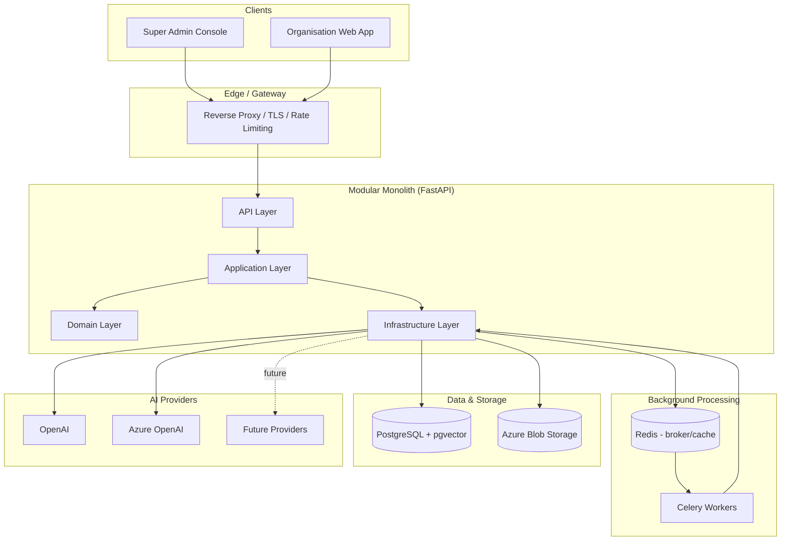
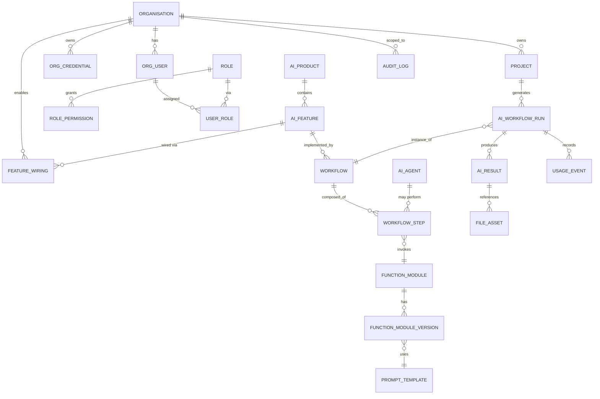
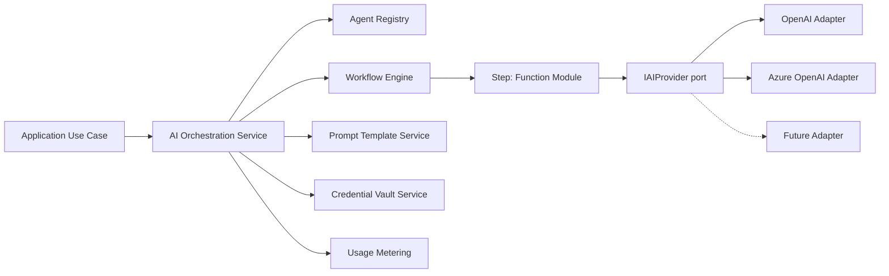

# CherukadAI Platform — Technical Architecture

Status: **Design phase — no application code implemented yet.**
This document is the deliverable requested before implementation begins.

---

## 0. Guiding Principles

1. **Platform first, product second.** Interior Design AI is the first *tenant product*, not the platform itself. Nothing product-specific may leak into the core (auth, tenancy, RBAC, workflow engine, orchestration).
2. **Configuration over code.** New AI products/features/workflows are added via data (Product/Feature/Agent/Workflow registries), not by forking the codebase.
3. **Backend is the security boundary.** The frontend only reflects entitlements; every request is re-validated server-side against the organisation's enabled features and the user's permissions.
4. **No AI-generated code executes directly.** All "self-generated instructions/codes" pass through **Draft → Validate → Approve → Version → Publish** before they can influence runtime behavior, and even then they run inside sandboxed, declarative Function Modules — never as raw `exec()`.
5. **Modular monolith, service-shaped.** Modules communicate through in-process interfaces that mirror what would become network calls (ports/adapters), so extraction to microservices later is a deployment change, not a redesign.

---

## 1. System Architecture (C4 – Context/Container)



**Core platform modules** (product-agnostic):
`identity`, `tenancy`, `rbac`, `catalog` (products/features/agents), `workflow-engine`, `function-modules`, `feature-wiring`, `credentials`, `usage-metering`, `audit`, `ai-orchestration`, `file-storage`, `notifications`.

**Product module** (first instance): `products/interior_design/*` — implements the domain logic for Interior Design AI using only the platform's public interfaces.

---

## 2. Frontend Architecture

**Stack:** Next.js (App Router) + React + TypeScript + Tailwind + shadcn/ui.

- **Two logical apps, one codebase** (route groups), sharing design system and API client:
  - `(super-admin)` — platform console (organisations, catalog, wiring, publish/rollback, usage, audit).
  - `(org)` — tenant application, dynamically rendered based on the organisation's **enabled feature manifest** fetched at login.
- **Entitlement-driven rendering:** on login, backend returns a signed "capabilities" payload (org id, enabled features, permissions). A `<FeatureGate>` component and route middleware hide/disable UI for anything not present — but this is UX only; server is authoritative.
- **Server components** for data fetching where possible; **Route Handlers/BFF** thin layer that forwards to FastAPI with the session cookie — no business logic in Next.js.
- **Auth:** HTTP-only secure cookies set by the backend; Next.js middleware checks session presence for route protection and redirects; actual authorization decisions always re-checked server-side.
- **State:** React Query (server cache) + minimal client state (Zustand) for UI-only state (wizards, drafts).
- **Product UI isolation:** each AI product owns a self-contained set of feature UI modules (`/app/(org)/products/interior-design/...`) registered in a frontend "product registry" so future products (Teacher AI, Marketing AI) plug in without touching shared shell code.
- **Design system:** shared shadcn/ui component library in `packages/ui` (if monorepo) consumed by both apps.

---

## 3. Backend Architecture (Clean Architecture, Modular Monolith)

```
API (FastAPI routers, DTOs, dependency wiring)
   -> Application (use cases / services, orchestration, DTO<->domain mapping)
       -> Domain (entities, value objects, domain services, ports/interfaces)
       -> Infrastructure (SQLAlchemy repos, Azure Blob, Celery tasks, AI provider adapters)
```

- **Dependency rule:** Domain has zero framework imports. Application depends only on Domain interfaces (ports). Infrastructure implements those ports. API depends on Application only.
- **No business logic in routers.** Routers: parse/validate request → call an Application use case → map result to response schema. Nothing else.
- **Dependency Injection:** FastAPI `Depends()` graph wires Infrastructure implementations into Application use cases at startup (a small composition root per module, e.g. `modules/workflow/wiring.py`), enabling swapping implementations (e.g., mock AI provider in tests) without touching business code.
- **Module boundary rule:** modules communicate only through each other's public `interface.py`/`ports.py`; no direct cross-module ORM imports. Enforced via lint rule (import-linter / custom CI check).
- **Cross-cutting concerns:** structured logging (structlog, JSON, request-id + tenant-id + user-id bound to every log line), centralized exception handlers mapping domain exceptions → RFC 7807 problem+json responses, request-scoped context (tenant, user, correlation id) via `contextvars`.
- **Configuration:** Pydantic Settings, layered (`.env` per environment + Azure Key Vault/App Config in production), never secrets in source or images.

---

## 4. Database Architecture

- PostgreSQL 15+, `pgvector` extension for embeddings (image/style/material similarity search).
- **Schema-per-concern**, not schema-per-tenant (avoids N-schema operational overhead at this stage): all tenant tables carry `organisation_id` and are protected by **Postgres Row-Level Security (RLS)** in addition to application-level filtering (defense in depth).
- SQLAlchemy 2 (typed, `Mapped[...]`), Alembic for migrations, one migration history for the whole monolith with clear per-module revision folders.
- Naming convention: `snake_case`, FK suffix `_id`, all tenant-scoped tables indexed on `organisation_id` (+ composite indexes for common query patterns).
- Soft-delete via `deleted_at` for auditable entities; hard-delete only for GDPR-style erasure via dedicated use case.
- All monetary/usage counters use append-only ledger tables (no destructive updates) for auditability.

### RLS pattern (example)
```sql
ALTER TABLE projects ENABLE ROW LEVEL SECURITY;
CREATE POLICY tenant_isolation ON projects
  USING (organisation_id = current_setting('app.current_org_id')::uuid);
```
The application sets `app.current_org_id` (and `app.current_user_id`) via `SET LOCAL` at the start of every transaction, sourced from the authenticated session — never from client-supplied input.

---

## 5. Entity Relationship Design (core)



Key tables (illustrative, not exhaustive): `organisations`, `org_users`, `roles`, `permissions`, `role_permissions`, `user_roles`, `ai_products`, `ai_features`, `ai_agents`, `workflows`, `workflow_versions`, `workflow_steps`, `function_modules`, `function_module_versions`, `prompt_templates`, `prompt_versions`, `feature_wirings`, `org_credentials`, `projects`, `ai_workflow_runs`, `ai_results`, `file_assets`, `usage_events`, `audit_logs`, `system_config`.

Every tenant-scoped table (all except platform catalog tables: `ai_products`, `ai_features`, `ai_agents`, `workflows`, `function_modules`, `prompt_templates` which are global definitions) includes `organisation_id NOT NULL`.

---

## 6. Authentication Architecture

- **Credential storage:** passwords hashed with **Argon2id** (never plaintext, never reversible encryption).
- **Session model:** server-side session (opaque token) stored in Redis/DB, referenced by an **HTTP-only, `Secure`, `SameSite=Lax` cookie**. Avoids storing JWTs client-side (mitigates XSS token theft); short-lived access + rotating refresh handled server-side.
- **Two identity realms:**
  - Super Admin identities (platform-level, `is_platform_admin`), separate login route `/auth/admin/login`.
  - Organisation user identities, scoped by `organisation_id`, login route `/auth/login` requires org context (subdomain or org-slug or email-domain resolution).
- **First-time setup:** on startup, if no Super Admin exists, backend exposes a **one-time setup token** (printed to server logs / injected via env var) required to call `POST /setup/super-admin`; endpoint auto-disables once a Super Admin exists (checked at DB level, not just a flag) and is rate-limited.
- **MFA-ready:** TOTP field on user reserved from day one (optional at v1, enforced later for Super Admin).
- **Password policy & lockout:** brute-force protection via login attempt counters + exponential backoff/lockout, generic error messages (no user enumeration).
- **CSRF:** double-submit cookie or same-site cookie + custom header check for state-changing requests, since cookies are used for auth.

---

## 7. Tenant Isolation Architecture

Defense in depth across four layers:

1. **AuthN layer:** session is bound to exactly one `organisation_id` (org users) or is platform-level (Super Admin, which is explicitly a different principal type).
2. **AuthZ / Application layer:** every Application use case receives a `TenantContext` (organisation_id, user_id, permissions) resolved from the session — **never** from request body/query params. Repositories require a `TenantContext` to run any tenant-scoped query (repository methods for tenant tables literally cannot be called without it — enforced by type signature).
3. **Database layer:** PostgreSQL RLS policies as a last line of defense, using a session-scoped GUC set per-transaction from the verified `TenantContext`, so even a missed `WHERE` clause cannot leak cross-tenant rows.
4. **Storage layer:** Azure Blob paths are namespaced `/{organisation_id}/{project_id}/...`; SAS tokens generated per-request scoped to that path prefix only.

**Testing requirement:** a dedicated `tests/security/test_tenant_isolation.py` suite runs against the real API (integration, not unit) that:
- Creates two organisations, seeds data.
- Confirms Org A tokens get `403/404` (not `200` with filtered data) on Org B resource IDs for every tenant-scoped endpoint.
- Confirms disabled-feature endpoints return `403` regardless of frontend state.
This suite is part of CI required checks — a PR cannot merge if it fails.

---

## 8. RBAC Architecture

- **Two-tier model:** Platform roles (`SUPER_ADMIN`, `PLATFORM_SUPPORT`) vs Organisation roles (`ORG_OWNER`, `ORG_ADMIN`, `ORG_MEMBER`, custom roles).
- **Permission-based, not role-name-based:** authorization checks are always `require_permission("projects:create")`, never `require_role("ORG_ADMIN")`, so permissions can be reassigned to roles without code changes.
- Permissions are namespaced strings: `<module>:<action>` e.g. `catalog:publish`, `workflow:approve`, `credentials:manage`, `feature:wire`, `project:create`, `ai_result:view`.
- `roles`, `permissions`, `role_permissions`, `user_roles` tables; Super Admin roles/permissions are global; Org roles/permissions are scoped by `organisation_id` (custom org roles allowed later).
- Enforcement via a FastAPI dependency `require_permission(perm: str)` that reads the resolved `TenantContext` + permission set (cached per session, invalidated on role change) and raises `403` centrally.
- **Feature-level authorization is separate from RBAC**: a user might have `feature:use` permission but the org might not have that feature *wired/enabled* — both checks are required (AND), see §10.

---

## 9. AI Orchestration Architecture



- **`IAIProvider` interface:** `complete(prompt, params) -> AIResponse`, `embed(text) -> vector`, `analyze_image(image, params)`, `generate_image(prompt, params)` — provider-agnostic contract. Concrete adapters (`OpenAIProvider`, `AzureOpenAIProvider`) live in Infrastructure, selected per-organisation/per-feature via configuration (Provider + model + credential reference), never hardcoded.
- **Agent abstraction:** an `AIAgent` is a registered, versioned configuration (persona/system prompt, allowed tools/function-modules, default model params) — not code. Agents are invoked by the Workflow Engine as a step type.
- **Credential isolation:** provider API keys stored encrypted at rest (envelope encryption; Azure Key Vault-backed key), referenced by `org_credentials.credential_ref`, resolved server-side only at call time inside Infrastructure — never returned to any API response or frontend.
- **Usage metering:** every provider call records tokens/cost/latency into `usage_events`, tagged by organisation, feature, workflow_run, for billing/monitoring.
- **Resilience:** timeouts, retries with backoff, circuit breaker per provider, fallback provider chain configurable per feature.

---

## 10. Feature Wiring Architecture

- **Catalog (global, Super-Admin managed):** `ai_products` → `ai_features` → default `workflows`.
- **Wiring (per-organisation):** `feature_wirings(organisation_id, ai_feature_id, workflow_version_id, status[enabled/disabled], config_overrides jsonb)`.
- **Publish/rollback:** wiring changes are versioned; "publish" activates a specific `workflow_version_id` for an org+feature; rollback simply repoints to a prior version — no destructive changes, full history retained (`feature_wiring_history`).
- **Runtime enforcement:** a single shared dependency `require_enabled_feature(feature_key)` used by every product-feature endpoint — looks up the org's `feature_wirings` row, checks `status == enabled` AND permission, else `403`. This is the mechanism guaranteeing "backend rejects disabled features" regardless of UI.
- **Entitlement payload:** on login/session-refresh, backend computes `{enabled_features: [...], permissions: [...]}` for the frontend to render `<FeatureGate>` — purely presentational, re-derived from the same `feature_wirings` table the backend enforces against.

---

## 11. Workflow Architecture

Models the given pipeline generically:
`Function Requirements → Function Scripts/Instructions → Codes/Workflows/API → Function Modules → Build Function Module`.

- **Workflow** = ordered/branching graph of **Workflow Steps**, versioned (`workflow_versions`), each version immutable once published.
- **Workflow Step types:** `function_module` (invoke a Function Module version), `ai_agent` (invoke an agent), `human_approval` (gate), `condition/branch`, `parallel/join`.
- **Execution:** `AI Workflow Run` = an instance of a published `workflow_version` for a given `organisation_id`/`project_id`, executed by the **Workflow Engine** (state machine persisted in DB: `pending → running → step_n → completed/failed`), steps dispatched as Celery tasks for long-running/AI steps so the API stays responsive (async job + polling/webhook/SSE for status).
- **Determinism & auditability:** every run stores the exact `workflow_version_id`, each step's inputs/outputs/prompt/version used, so results are reproducible and explainable.
- **Not a generic code interpreter:** the engine only executes declared step types against declared Function Module *versions* — it never dynamically evaluates arbitrary strings as code.

---

## 12. Function Module Architecture

Implements: `Self Generated Instructions & Codes → Validate & Update → Build` safely, and the module lifecycle **Draft → Validate → Approve → Version → Publish**.

- **Function Module** = a declarative, sandboxed unit of capability: metadata + input/output JSON Schema + implementation reference. Two supported implementation kinds initially:
  1. **Prompt-based module** — references a `PromptTemplate` + provider/model config (no code at all; safest, most common case for AI features).
  2. **Built-in Python module** — a *first-party*, code-reviewed, registered Python callable shipped in the platform repo (`function_modules/builtin/*.py`) and registered in the DB catalog by key — this is how "codes" become available, but the code itself is only ever authored/reviewed/deployed by the platform team through normal CI/CD, **never** generated-and-executed at runtime.
- **No dynamic/arbitrary code execution path exists.** If future requirements demand user-authored code (e.g., custom formulas), it must go through a heavily sandboxed, resource-limited interpreter for a restricted DSL (not raw Python), added as an explicit future ADR — out of scope for v1 and called out as a hard constraint.
- **Lifecycle states:** `draft` (editable) → `validated` (schema/lint/test-run against fixtures passes) → `approved` (Super Admin sign-off, immutable) → `versioned` (semantic version cut) → `published` (usable by Workflow Engine). Each transition recorded in `function_module_version_history` with actor + timestamp (audit).
- **Validation gate:** automated checks (JSON Schema validity, prompt variable coverage, provider dry-run on fixture inputs, cost/latency sanity) must pass before `approved` is reachable; manual Super Admin approval always required regardless of automated pass.

---

## 13. Interior Design Module Architecture

Maps the 5-stage business process to the generic platform, as a **product module** (`products/interior_design`) consuming only platform interfaces:

| Stage | Example AI Features | Function Modules (examples) |
|---|---|---|
| 1. Discovery & Briefing | Requirement extraction, brief summarization | `extract_brief_fields`, `summarize_client_notes` |
| 2. Concept & Schematic Design | Image Analysis, Concept Generation, Material AI | `analyze_room_image`, `generate_concept_image`, `suggest_materials` |
| 3. Design Development & Working Drawings | BOQ AI, Drawing annotation | `generate_boq`, `annotate_drawing` |
| 4. Execution & Procurement | Vendor/material matching, cost tracking | `match_vendor_catalog`, `procurement_summary` |
| 5. Styling, Snagging & Handover | Snagging checklist AI, handover doc generation | `generate_snagging_checklist`, `generate_handover_doc` |

- Each feature = one row in `ai_features` (product = "Interior Design AI"), wired per-organisation via Feature Wiring, backed by one or more Workflows built from the Function Modules above.
- `projects` (per-organisation) hold the Interior Design domain aggregate (rooms, briefs, assets); `ai_results` store outputs (images, BOQ documents, checklists) as `file_assets` + structured JSON, linked to the `ai_workflow_run` that produced them for traceability.
- Image-heavy steps use Pillow/OpenCV in Infrastructure-layer image-processing services, invoked by relevant Function Modules; embeddings (style/material similarity) stored via `pgvector`.
- **No platform-core code references "Interior Design"** — the mapping above lives entirely in seed data (catalog rows) + this one product module.

---

## 14. File Storage Architecture

- **Abstraction:** `IFileStorage` port — `upload`, `download_url` (SAS), `delete`, `list` — Infrastructure implementation `AzureBlobStorage`; local `FakeFileStorage`/Azurite for tests.
- **Tenant-namespaced paths:** `container/{organisation_id}/{project_id}/{asset_id}.{ext}`.
- **Access:** all client access via short-lived, scope-limited **SAS URLs** minted server-side after authorization check — clients never get storage account keys.
- **Metadata:** `file_assets` table tracks owner org, project, content type, size, checksum, virus-scan status (pluggable), linked `ai_result_id`.
- **Validation:** MIME/type allow-list, size limits, optional AV scan hook before marking `available`.

---

## 15. Background Job Architecture

- **Redis** as Celery broker + result backend + cache (entitlements, permission sets, rate-limit counters).
- **Celery workers**, separate queues by workload class: `queue=ai_heavy` (long AI calls/image gen), `queue=default` (short tasks), `queue=notifications`. Autoscale workers per queue independently.
- **Task = thin wrapper** calling an Application use case (same rule as API routers) — business logic not duplicated in tasks.
- **Idempotency:** tasks keyed by `workflow_run_id + step_id`; safe to retry (checked via DB state before re-executing a step).
- **Reliability:** `acks_late` + retry policy with exponential backoff + max-retries → step marked `failed`, workflow run surfaces error; dead-letter queue for manual inspection.
- **Scheduled jobs** (Celery beat): usage roll-ups, audit log retention/archival, credential rotation reminders, stale draft cleanup.

---

## 16. Monitoring Architecture

- **Structured logging:** JSON logs (structlog) with correlation fields: `request_id`, `organisation_id`, `user_id`, `workflow_run_id`; shipped to Azure Monitor/Log Analytics (or ELK) — no PII/secrets logged.
- **Metrics:** Prometheus-style metrics endpoint (request latency/count by route, Celery queue depth/latency, AI provider latency/error rate/token usage/cost) scraped into Grafana/Azure Monitor dashboards.
- **Tracing:** OpenTelemetry instrumentation across API → Application → Infrastructure → Celery → AI provider calls, single trace per workflow run.
- **Alerting:** error-rate, queue-backlog, provider-failure-rate, auth-failure-spike alerts.
- **Audit logs** (`audit_logs`): distinct from operational logs — immutable, tenant-scoped, queryable by Super Admin (and org admins for their own org), covering all sensitive actions (publish, rollback, credential changes, permission changes, login).

---

## 17. Security Architecture

- OWASP Top 10 mapped controls:
  - **Access control:** RBAC + tenant isolation + RLS (A01).
  - **Crypto failures:** Argon2id passwords, envelope-encrypted credentials, TLS everywhere, secrets only in Key Vault/App Config (A02).
  - **Injection:** SQLAlchemy parameterized queries only, Pydantic validation at every boundary, no raw string SQL (A03).
  - **Insecure design:** Draft→Validate→Approve→Version→Publish gate; no arbitrary code execution (A04).
  - **Security misconfiguration:** hardened Docker images, no debug mode in prod, strict CORS, security headers (CSP/HSTS/X-Frame-Options) (A05).
  - **Vulnerable components:** dependency scanning (pip-audit/Dependabot, `npm audit`) in CI (A06).
  - **AuthN failures:** lockout, MFA-ready, secure cookie sessions (A07).
  - **Data integrity:** signed/versioned workflow & function module artifacts, audit trail (A08).
  - **Logging/monitoring failures:** centralized structured logs + alerting (A09).
  - **SSRF:** outbound calls (AI providers, webhooks) via allow-listed hosts only, no user-controlled URLs fetched server-side without validation (A10).
- **Secrets management:** Azure Key Vault (prod) / `.env` + `direnv` (local, git-ignored); app reads via config layer, never hardcoded.
- **Rate limiting** at gateway + per-endpoint (auth, AI-invocation) to control cost/abuse.
- **Input validation:** Pydantic schemas for every request/response; file upload validation (§14).

---

## 18. Deployment Architecture

- **Local/dev:** Docker Compose — `api`, `worker`, `beat`, `web` (Next.js), `postgres`, `redis`, `azurite` (Blob emulator), `mailhog`/notification stub.
- **Azure-ready target:**
  - Azure Container Apps (or AKS later) for `api`, `worker`, `web`.
  - Azure Database for PostgreSQL Flexible Server (with pgvector).
  - Azure Cache for Redis.
  - Azure Blob Storage.
  - Azure Key Vault for secrets, Azure App Configuration for feature flags/config.
  - Azure Monitor/Log Analytics/Application Insights.
- **CI/CD:** build → lint/type-check → unit tests → integration tests (incl. tenant isolation suite) → build images → push to ACR → deploy (blue/green or rolling) → run Alembic migrations as a release step (not on container boot in prod) → smoke tests.
- **Environments:** `local`, `dev`, `staging`, `production`, config isolated per environment; production requires manual approval gate for deploy.
- **Extraction path to microservices:** because module boundaries already only talk through ports/interfaces and each module owns its tables, a future split (e.g., `ai-orchestration` as its own service) requires: (1) move module folder to its own deployable, (2) replace in-process port implementation with an HTTP/gRPC client implementing the same interface, (3) no change to Application/Domain code elsewhere.

---

## 19. Testing Strategy

- **Unit tests (pytest):** Domain + Application layers, fully mocked ports (fast, no DB/network).
- **Integration tests (pytest + FastAPI TestClient/httpx + real Postgres in a test container):** API contracts, RLS behavior, RBAC enforcement, feature-wiring enforcement, workflow execution against a mocked `IAIProvider`.
- **Tenant isolation suite:** mandatory CI gate (see §7) — multi-org fixtures, verifies 403/404 on cross-tenant access for every tenant-scoped route.
- **Contract tests for `IAIProvider` adapters:** shared test suite run against a fake provider and (optionally, gated) real providers in a separate nightly job.
- **E2E (Playwright):** critical user journeys — Super Admin first-time setup, create org → wire feature → org user logs in → sees only enabled features → runs Interior Design workflow → views result; also a negative E2E confirming disabled features are invisible and inaccessible.
- **Load/perf (later phase):** k6/Locust against AI orchestration + workflow engine before GA.
- **Coverage gates + static analysis:** `mypy`/`pyright` for backend types, `ruff`/`black`, `eslint`/`tsc` for frontend, enforced in CI.

---

## 20. Development Phases

**Phase 0 — Foundations**
Repo/monorepo scaffold, Docker Compose, CI skeleton, config/logging/error-handling framework, Alembic baseline, empty Clean Architecture module template + import-boundary lint rule.

**Phase 1 — Identity, Tenancy, RBAC**
Super Admin first-time setup, organisations, org users, sessions/cookies, roles/permissions, `TenantContext`, RLS policies, tenant-isolation test suite (from day one, not after the fact).

**Phase 2 — Platform Catalog & Feature Wiring**
AI Products/Features/Agents CRUD (Super Admin), Feature Wiring model + enforcement dependency, entitlement payload for frontend, Super Admin console UI shell.

**Phase 3 — Workflow Engine & Function Modules**
Workflow/Workflow Version/Workflow Step models, Function Module lifecycle (Draft→Validate→Approve→Version→Publish), Prompt Template management, Celery-backed execution engine with a no-op/mock provider.

**Phase 4 — AI Orchestration**
`IAIProvider` + OpenAI/Azure OpenAI adapters, credential vault, usage metering, resilience (retry/circuit breaker), orchestration service wiring providers into workflow steps.

**Phase 5 — File Storage & Background Processing hardening**
Azure Blob abstraction (+ Azurite for dev), SAS-based access, queue segregation, idempotent tasks, scheduled jobs.

**Phase 6 — Interior Design AI (first product)**
Product module scaffold, seed catalog data for the 5 stages, Function Modules for image analysis/concept generation/material AI/BOQ AI, project & AI-result domain models, org-facing UI.

**Phase 7 — Observability & Security Hardening**
Structured logging rollout, metrics/tracing, audit log UI, security header/CSP pass, dependency scanning, penetration-test readiness review.

**Phase 8 — Testing, Hardening, Beta**
Full Playwright E2E suite, load testing, staging deployment on Azure, pilot organisation onboarding.

**Phase 9 — GA & Extensibility Proof**
Formal ADR + scaffold for a second AI product (e.g., Teacher AI) using only public platform interfaces, proving "no core rewrite" claim before wider GA.

*(Explicit instruction acknowledged: implementation will not begin until this architecture is reviewed and the next instruction is given.)*

---

## 21. Proposed Project Folder Structure

```
cherukadai/
├── apps/
│   ├── web/                          # Next.js app (Super Admin + Org UI)
│   │   ├── app/
│   │   │   ├── (super-admin)/
│   │   │   │   ├── organisations/
│   │   │   │   ├── catalog/          # products/features/agents
│   │   │   │   ├── workflows/
│   │   │   │   ├── function-modules/
│   │   │   │   ├── feature-wiring/
│   │   │   │   ├── usage/
│   │   │   │   └── audit-logs/
│   │   │   ├── (org)/
│   │   │   │   ├── dashboard/
│   │   │   │   └── products/
│   │   │   │       └── interior-design/
│   │   │   │           ├── discovery/
│   │   │   │           ├── concept/
│   │   │   │           ├── working-drawings/
│   │   │   │           ├── procurement/
│   │   │   │           └── handover/
│   │   │   └── (auth)/
│   │   │       ├── login/
│   │   │       └── setup/            # first-time super admin setup
│   │   ├── components/               # feature-agnostic UI
│   │   ├── lib/                      # api client, auth helpers, FeatureGate
│   │   └── ...
│   └── api/                          # FastAPI backend
│       ├── src/
│       │   ├── main.py               # app factory, exception handlers, middleware
│       │   ├── config/               # settings, logging config
│       │   ├── platform_core/        # product-agnostic modules
│       │   │   ├── identity/
│       │   │   │   ├── domain/
│       │   │   │   ├── application/
│       │   │   │   ├── infrastructure/
│       │   │   │   └── api/
│       │   │   ├── tenancy/
│       │   │   ├── rbac/
│       │   │   ├── catalog/          # ai_products / ai_features / ai_agents
│       │   │   ├── feature_wiring/
│       │   │   ├── workflow_engine/
│       │   │   ├── function_modules/
│       │   │   ├── prompts/
│       │   │   ├── ai_orchestration/
│       │   │   │   ├── domain/ports.py     # IAIProvider
│       │   │   │   ├── infrastructure/providers/
│       │   │   │   │   ├── openai_provider.py
│       │   │   │   │   └── azure_openai_provider.py
│       │   │   ├── credentials/
│       │   │   ├── file_storage/
│       │   │   │   ├── domain/ports.py     # IFileStorage
│       │   │   │   └── infrastructure/azure_blob.py
│       │   │   ├── usage/
│       │   │   └── audit/
│       │   ├── products/             # product-specific modules
│       │   │   └── interior_design/
│       │   │       ├── domain/
│       │   │       ├── application/
│       │   │       ├── infrastructure/
│       │   │       │   └── image_processing/   # Pillow/OpenCV
│       │   │       └── api/
│       │   ├── workers/              # Celery app, task definitions per module
│       │   │   ├── celery_app.py
│       │   │   └── tasks/
│       │   └── shared_kernel/        # cross-module value objects, base classes,
│       │                             # error types, pagination, common utils
│       ├── alembic/
│       │   ├── env.py
│       │   └── versions/
│       ├── tests/
│       │   ├── unit/
│       │   ├── integration/
│       │   └── security/
│       │       └── test_tenant_isolation.py
│       └── pyproject.toml
├── e2e/                               # Playwright tests
├── infra/
│   ├── docker/
│   │   ├── api.Dockerfile
│   │   ├── web.Dockerfile
│   │   └── worker.Dockerfile
│   ├── docker-compose.yml
│   ├── docker-compose.override.yml
│   └── azure/                        # bicep/terraform (later)
├── docs/
│   └── ARCHITECTURE.md               # this document
├── .github/workflows/                # CI pipelines
└── README.md
```

---

## Open Points to Confirm Before Implementation

1. Monorepo tooling preference for `apps/web` + `apps/api` (npm/pnpm workspaces + a Python workspace, or fully separate repos)?
2. Preferred identity resolution for org login (subdomain per org vs. org-slug field vs. email-domain mapping)?
3. Initial permission set granularity — start minimal (owner/admin/member) or design full custom-role editor now vs. later phase?
4. Confirm Celery vs. an alternative (e.g., Arq/Dramatiq) — Celery assumed per stack list unless you prefer lighter-weight.

Awaiting confirmation/next instruction before implementation begins.
